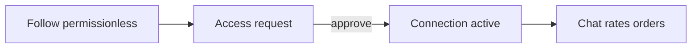

# Shared concepts

## Purpose

Vocabulary and trust rules that every feature assumes. Read this before catalog, Explore, access, or chat docs.

## Who uses it

Everyone on the platform — buyers, sellers, and dual-role companies.

## Core model

| Concept | Meaning |
|---------|---------|
| **Company account** | The trading entity. Product pitch is one company, no “are you a buyer or seller?” role enum. |
| **Contact person** | The logged-in user’s display name (e.g. Ravi) — distinct from the **business name** (e.g. Surat Silk House). |
| **Capabilities** | Stored flags: `publish`, `relist`, `refer`. Unlock progressively; never a role picker. |
| **Trade presence** | `buyingEnabled` / `sellingEnabled` toggles what ＋ and Home emphasize. Creating catalog content turns selling back on. |

Membership roles (`owner` / `staff`) and permissions exist in the domain for future team use; Phase 1 UX treats the signed-in company as the actor.

## Trust ladder

| Mechanism | What it is |
|-----------|------------|
| **Follow** | Permissionless. See followed posts on Home / Explore “following”. Does **not** unlock full catalog or trade. |
| **Access request** | Named gate: note + optional referral. Approve / decline. |
| **Connection** | After approve: `active` → catalog visibility & trade. Owner can **pause** or **block** (silent to the other party). |
| **Block / pause** | Viewer is not told. API returns **404** (not 403). Approve never reactivates a block — must **unblock** first. |

## Catalog lifecycle

| Status | Designs & collections |
|--------|------------------------|
| **Draft** | Private library / album work-in-progress |
| **Published** | On the company shop (catalog-published) |
| **Archived** | Ended / out of season |

### Publish ≠ Explore

| Action | Effect |
|--------|--------|
| **Catalog publish** | Design or collection is published for the shop / connections per audience rules. First-ever publish requires **consent to sell** → sets `canPublish`. |
| **Post to Explore** | Separate step for designs (`postedToMarketAt`). Collections surface on Explore when published (activity bump rules apply). |
| **Unpublish / hide** | Returns to draft; design Explore post is cleared when a design is unpublished. |

### Audience & rates

When publishing (or posting to market), the sheet sets:

| Field | Values | Default practice |
|-------|--------|------------------|
| **Audience** | `everyone` · `connections` · `selected` (+ company IDs) | Connections |
| **Rate visibility** | `visible` · `on_request` | On request |

## Designs vs collections

| | Designs | Collections |
|--|---------|-------------|
| Role | First-class library items | Named albums that **group** designs |
| Standalone | Yes — sell or Explore alone | Always made of designs |
| Many-to-many | A design can sit in many collections | — |

See [Catalog](./catalog.md) and [Collections](./collections.md).

## Where it lives

- Contracts: `packages/domain-types/src/enums.ts`, `access.ts`, `company.ts`, `catalog.ts`
- Visibility: `apps/api/src/access/visibility.service.ts`
- Publish consent: `apps/api/src/catalog/publish-capability.ts`
- Trade presence: `apps/api/src/identity/trade-presence.ts`
