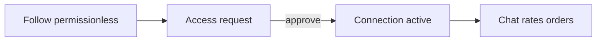

# Shared concepts

## Purpose

Vocabulary and trust rules that every feature assumes. Read this before catalog, Explore, access, or chat docs.

## Who uses it

Everyone on the platform — buyers, sellers, and dual-role companies.

## Core model

| Concept | Meaning |
|---------|---------|
| **Company account** | The trading entity. Product pitch is one company, no “are you a buyer or seller?” role enum. |
| **Contact person** | The logged-in user’s display name (e.g. Ravi) — distinct from the **business name** (e.g. Surat Silk House). |
| **Capabilities** | Stored flags: `publish`, `relist`, `refer`. Unlock progressively; never a role picker. |
| **Trade presence** | `buyingEnabled` / `sellingEnabled` toggles what ＋ and Home emphasize. Creating catalog content turns selling back on. |

Membership roles (`owner` / `staff`) and five caps (`uploads` · `chats` · `orders` · `payments` · `team`) sit on the person. The **company** still trades. **You → Team** invites staff by phone. Counterparties see the business name. Owner-only chats stay hidden from staff.

## Platform & dual-network companies

Ekum is a **wholesale platform**, not a single-hop shop:

- Every company **knows its own sellers and its own buyers** (direct upstream / downstream).
- Goods may travel a **long chain** (mill → wholesaler → trader → retailer …). Each hop is a company that may curate, publish, and trade.
- Counterparties appear as normal **businesses** — no Trader / Seller badges; buyers often need not know whether a publisher is a mill or a middleman.
- UI works **1-hop** relationships by default; full-chain map is not forced on every screen.

Some companies are dual-network (**traders** in product language only): buy, curate, share, follow up — still one company account, no OTP “Trader” role. Capability **`relist`** is the product gate for curated publish from others’ catalogs.

| Intent | Rule (much of this is **planned**, not shipped) |
|--------|--------------------------------------------------|
| Curate | Pick designs/collections from one or more suppliers into a **curated collection** for their buyers |
| Saved | **Reference** shortlist of designs/collections (not a copy catalog); hub under You; feeds Curate pack — see Slice A design |
| Publish | Same audience model as any publish — **Explore is not supplier-only** |
| Permission ceiling | Cannot outrun the **original seller’s** audience / **buyers can forward** lock |
| Forward vs Curate | **Forward** = share someone’s card as-is; **Curate** = assemble into **your** collection then publish (still under source ceiling) |
| Stories | Viewer sees a company when they **follow or are connected** and it has **published** to feed (own or curated) |
| Explore trade-side | **All** (default) · **Buying** · **Selling** — see [explore](./explore.md) |
| Surfaces | **Home** = light **New packs** (curated received, 7 days / 5); **Buying** Explore = followed posts + received by day/business |
| Dual trade | Company may **buy/pay upstream** and **sell/send orders downstream**. **Trading** presence (`I trade on Ekum`) gates Curate + Manage/Direct; product default off (QA may treat unset as on). Linking/split in Slice B |
| Orders | Curated pack → **Manage** (buyer↔trader + linked upstream by `product.companyId`); forward → **Direct** (facilitator informed, Take control). Soft-hide ends on Manage |

See [mvp-garmenthub-gap-matrix.md](../superpowers/reviews/mvp-garmenthub-gap-matrix.md) for Keep / Missing / slice tracking.

## Trust ladder

| Mechanism | What it is |
|-----------|------------|
| **Follow** | Permissionless. See followed posts on Home / Explore “following”. Does **not** unlock full catalog or trade. |
| **Access request** | Named gate: note + optional referral. Approve / decline. |
| **Connect invite** | Open referral link (`/r/:token`) — redeem sends an access request to the sender (they approve); targeted vouch still needs the target’s approve. |
| **Connection** | After approve: `active` → catalog visibility & trade. Owner can **pause** or **block** (silent to the other party). |
| **Block / pause** | Viewer is not told. API returns **404** (not 403). Approve never reactivates a block — must **unblock** first. |

## Catalog lifecycle

| Status | Designs | Collections |
|--------|---------|-------------|
| **Draft** | Private library work-in-progress | Album work-in-progress |
| **Published** | On the company shop | Live for buyers only inside `startsAt`/`endsAt` window |
| **Archived** | Ended / out of season | Ended / out of season |

### Collection live window & badges

| Field | Meaning |
|-------|---------|
| `startsAt` null | Live as soon as published |
| `endsAt` null | **Evergreen** (no scheduled hide) |
| Past `endsAt` | Same as Hide → **draft** (job + read guards; not auto-archive) |

Seller My Catalog badges: **Draft** · **Starts…** · **Live** (+ **Evergreen** or **Ends…**) · **Archived**.

### Publish = Explore

| Action | Effect |
|--------|--------|
| **Publish** | Design or collection goes live for the chosen **audience** on Explore (and shop). Designs set `postedToMarketAt`. First-ever publish requires **consent to sell** → sets `canPublish`. |
| **Visibility** | Same sheet as publish — change who can see it / rates / forward without a separate “post” step. |
| **Hide / unpublish** | Returns to draft; design Explore post is cleared (`postedToMarketAt` null). Collection hide clears `exploreActivityAt`. |

### Audience, rates & forward

When publishing (or updating visibility), the sheet sets:

| Field | Values | Default practice |
|-------|--------|------------------|
| **Audience** | `everyone` · `connections` · `followers` · `selected` (+ company IDs and optional **Buyer group(s)**) | Connections |
| **Rate visibility** | `visible` · `on_request` | On request (or company usual) |
| **Buyers can forward** | checkbox (on by default) | Uncheck = lock this pack/design |

| Audience | Who sees on Explore |
|----------|---------------------|
| Everyone | Any signed-in company (existing block/trust rules) |
| Connections | Active connections with the seller |
| Followers | Companies that follow the seller (not necessarily connected) |
| Selected | Listed companies / buyer groups |

**Layers (simple):** company usual (last publish remembered in `tradeDefaults.publishDefaults`) → selected buyer-group override(s), **strictest wins** if several → this item’s Publish sheet. Snapshot on `Product.allowForward` / `Collection.allowForward`. `audienceGroupIds` restores which groups were chosen on **Visibility** (expand who later without a second pack). One collection may include many groups (member union); not per-group policies on one card.

**Staff audit:** Product, Collection, and Order store `createdByUserId` / `updatedByUserId` (names on list/detail). Full AuditLog history UI is later.

**Trust:** When locked (`allowForward === false`), only the **owner** may **Forward** that card into chat / Explore / broadcast. Non-owners get `FORWARD_NOT_ALLOWED` — even if the post is open to Everyone. **Order / Ask rates** follow **discoverability** (audience): open posts trade without Connection; Forward still needs `allowForward`. **Curate / relist** is a separate verb: assemble into your own collection then publish, still within the source permission ceiling — not the same as Forward. Never claim “exclusive” without the forward gate.

## Designs vs collections

| | Designs | Collections |
|--|---------|-------------|
| Role | First-class library items | Named albums that **group** designs |
| Standalone | Yes — sell or Explore alone | Always made of designs |
| Many-to-many | A design can sit in many collections | — |

See [Catalog](./catalog.md) and [Collections](./collections.md).

## Where it lives

- Contracts: `packages/domain-types/src/enums.ts`, `access.ts`, `company.ts`, `catalog.ts`
- Visibility: `apps/api/src/access/visibility.service.ts`
- Publish consent: `apps/api/src/catalog/publish-capability.ts`
- Trade presence: `apps/api/src/identity/trade-presence.ts`
