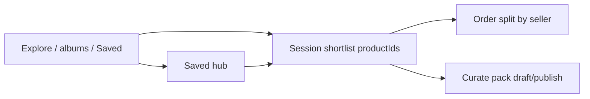

# Browse select · Curate · multi-supplier Order — design

**Date:** 2026-08-19  
**Status:** Draft (product-approved direction; not implemented)  
**Surface:** Explore, collection viewer, Saved, Explore design detail — shared select bar; Order split; Curate from selection  
**Anchors:** [00-concepts.md](../../features/00-concepts.md), [saved.md](../../features/saved.md), [orders.md](../../features/orders.md), [collections.md](../../features/collections.md), [2026-08-19-trader-curation-slice-a-design.md](./2026-08-19-trader-curation-slice-a-design.md)

## Problem

Slice A shipped **Saved** + **Curate pack** as a separate picker page. That fights Ekum’s pattern (**Select / long-press → sticky bottom verbs**) and makes multi-supplier shopping awkward:

1. **Saved is hard to reach** (avatar → More → Saved).
2. **Curate** is a second pick screen instead of an action on an existing selection.
3. **Selection dies per album** (`sessionStorage` keyed by collection id), so a trader cannot tick Jaipur designs, browse Ahmedabad, and Order/Curate/Share the mixed set.
4. **Order** still assumes one `sellerCompanyId` per request; mixed suppliers need **N orders** from one gesture.

Anyone may buy and curate (no trader role). Curate must sit beside Order/Share wherever those verbs already appear — including Explore.

## Goals

- **Faster Saved:** one-tap from Explore (header bookmark); also **＋ → Saved**; More → Saved remains fallback.
- **Ekum select pattern:** Select / long-press → sticky bar with **Order** and **Curate** (and **Share** where Forward already exists).
- **Traveling design shortlist:** one session selection of **product ids** across Explore ↔ collections ↔ Saved while browsing.
- **Curate from selection:** name → Save draft / Publish… (existing ceiling + publish sheet). No separate “pick again from Saved” as the primary path.
- **Multi-supplier Order:** one qty/confirm UX → split by `product.companyId` → **N living orders** → confirmation with **a link per supplier chat**.
- **Opaque businesses:** no Trader/Seller badges; capabilities only.

## Non-goals (this design)

| Out | Notes |
|-----|--------|
| Album-select expand-on-action | Deferred — album tiles stay “open to pick designs” |
| In-loop / anonymity / trader pays upstream then sells downstream | Later Slice B/D economics |
| Auto Connection on open Order | Unchanged — open discoverable trade may create Active trade thread without Connection |
| Replacing bottom nav with Saved | Rejected — header + ＋ only |
| Product copy / snapshot rows | Still Reference provenance from Slice A |
| OTP trader role | Rejected |

## Concepts

| Term | Meaning |
|------|---------|
| **Session shortlist** | Client session set of **design (`productId`)** selections for Order / Curate / Share. Not the same as **Saved** (durable server references). |
| **Saved** | Durable bookmarks (design and/or collection refs). Feed for later; not required before Curate if designs are already on the shortlist. |
| **Curate** | Build **your** collection from selected upstream product refs → draft/publish under source ceiling. |
| **Order (split)** | One user Order action over mixed lines → one Order (+ trade thread) per distinct `product.companyId`. |
| **Share / Forward** | Pass supplier card(s) as-is; still gated by `allowForward`. |

## UX

### Saved access

| Entry | Behavior |
|-------|----------|
| **Explore header** bookmark | Opens `/saved` (primary) |
| **＋ sheet → Saved** | Same hub |
| **More → Saved** | Fallback |
| Optional later | Home strip when Saved non-empty — not required for first plan |

### Entering select mode

- Header **Select** and/or **long-press** on a design tile (collection grid, Explore feed where designs are selectable, Saved design tiles).
- First long-press adds that design and shows the bar.
- Tap toggles membership while select mode is on.
- **Album / collection tiles in Saved:** tap opens the album (pick designs there). Do **not** put `collectionId` on the Order/Curate line set in this slice.

### Traveling shortlist

- Replace per-collection `ekum:shortlist:{collectionId}` with one session key (e.g. `ekum:browseShortlist`) holding product ids (+ optional thumb/name/company cache for the bar).
- Navigating Explore ↔ collection A ↔ collection B ↔ Saved **keeps** ticks.
- Designs not visible on the current page still count toward the bar (“3 selected”).
- **Clear** only when: user clears; successful Order (all or agreed partial — see below); successful Curate that consumes the selection; logout / session end. Do **not** clear merely because the route changed.
- After Order/Curate, clear the consumed product ids from the shortlist (full clear if the action used the whole set).

### Sticky bottom bar

When shortlist size ≥ 1 (above bottom nav):

| Action | When shown | Behavior |
|--------|------------|----------|
| **Order** | Every selected design is trade-allowed (connected **or** open/discoverable per existing `TradeAccess`) | Qty sheet over the set → submit → split |
| **Curate** | Every selected design passes curate ceiling (`allowForward` + discoverable) | Name sheet → Save draft / Publish… |
| **Share** | Surfaces that already support Forward; each selected design `allowForward` | Existing Forward UX for the set (plan may start with single-select Share if multi-Forward is heavy) |
| Count / Clear / Select all (page-local) | Always in select chrome | Select all only affects **visible** designs on the current surface; does not wipe off-page shortlist members |

If some lines fail ceiling for Curate but Order is OK (or vice versa), show the allowed verbs; hide or disable the other with plain copy on tap (“This seller doesn’t allow sharing.”).

### Explore

- Selectable designs on Explore (and open design detail) participate in the **same** shortlist.
- Design detail sticky actions include **Order** and **Curate** (Curate = add this design to shortlist and open name/publish flow, or add + jump to bar — prefer: add to shortlist and open Curate sheet for current selection including this design).
- Explore header bookmark → Saved.

### Curate from selection (replaces primary Curate-pack picker)

1. User has ≥1 shortlisted designs (any suppliers).
2. **Curate** → name (default collection name helper) → **Save draft** or **Publish…**.
3. Server: create collection + set members (existing Slice A membership + ceiling).
4. **＋ → Curate pack** becomes a shortcut: navigate to Explore or Saved **with select mode on**, or open empty shortlist hint — not a disconnected second catalog picker. Deep link `/catalog/curate` may remain as “Curate using current shortlist / Saved designs” during transition.

### Multi-supplier Order

1. Qty sheet lists selected designs (grouped visually by business if easy).
2. Client (or API) groups lines by `product.companyId`.
3. For each seller group: create Order with that `sellerCompanyId` + those lines (reuse today’s create + living card + `ensureTradeThread` rules, including open-audience trade).
4. **Confirmation sheet:** “2 orders placed” with **one row/link per chat** (business name → thread).  
   - Partial failure: “1 of 2 placed” — list successes with links; failed seller with retry.
5. Do **not** auto-enter only the first thread as the sole success UX.

Samples / Ask for rates: same split rule when launched from a multi-supplier shortlist (same confirmation shape).

## API / data (sketch)

| Change | Intent |
|--------|--------|
| Prefer `POST /orders/batch` or documented multi-create | Body: lines with productIds; server groups by product owner, asserts trade per seller, returns `{ orders: [{ orderId, threadId, sellerCompanyId, … }], failures: […] }` |
| Or client N× `POST /orders` | Allowed for first cut if confirmation UX is solid; server batch preferred for atomicity messaging |
| No schema change for shortlist | Session-only on web |
| Curate | Existing `POST /collections` + `PUT …/products` + ceiling |
| Saved | Unchanged persistence; hub UX + entry points only |

Server remains source of truth for trade and curate ceiling; never trust client “all one seller.”

## Permission rules (unchanged principles)

- **Order line seller** = `product.companyId` (Reference model).
- **Trade:** connection **or** all products in that seller group discoverable/open (existing `TradeAccess`).
- **Curate / Share:** `allowForward` + discoverability; publish audience still cannot outrun source intent (Slice A).
- **Saved album** ≠ orderable entity.

## Success criteria

- From Explore, open Saved in one tap (header bookmark).
- Select designs in supplier A’s album, open supplier B’s album / Explore, shortlist count still includes A’s designs; Order creates two orders and shows confirmation with two chat links.
- Curate from that mixed shortlist creates one curator-owned collection with foreign members; publish respects ceiling.
- Curate control appears on Explore design / collection select bar alongside Order (when allowed).
- Per-collection-only shortlist persistence is gone for this flow.
- Seed walkthrough (Ravi): save/select Kavita + Meena designs → one Order action → two chats linked on confirmation; Curate → one pack.

## Relationship to slices

| Piece | Slice |
|-------|--------|
| Saved + reference Curate + ceiling | **A** (done) — this design remounts UX |
| Traveling shortlist + Curate on bar + Saved entry | **A follow-up / UX** |
| Order (and sample) split + confirmation | **B** (order fan-out); may ship in same plan as UX if scoped |

Implementation plan should sequence: (1) session shortlist + bar verbs + Saved entry + Curate-from-selection, (2) order/sample batch split + confirmation — unless product wants B first.

## Deferred

- Expand selected **album** bookmarks into member products at Order/Curate time.
- Home “Saved” attention strip.
- Multi-Forward UX polish beyond single-card Forward.
- Linking downstream buyer order ↔ upstream supplier orders / in-loop.

## Next

Product reviews this file → implementation plan under `docs/superpowers/plans/` → implement (no code until plan approval).
