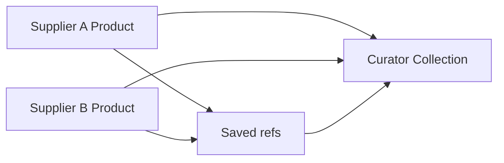

# Trader curation Slice A — design

**Date:** 2026-08-19  
**Status:** Implemented (Slice A — curate + Saved references)  
**Surface:** Curate pack + **Saved** references → draft/publish collection of **upstream product references**  
**Anchors:** [00-concepts.md](../../features/00-concepts.md), [collections.md](../../features/collections.md), [explore.md](../../features/explore.md), [mvp-garmenthub-gap-matrix.md](../reviews/mvp-garmenthub-gap-matrix.md)

## Problem

Dual-network companies (wholesale “traders”) need to assemble designs from **multiple suppliers** into **one curated pack**, then publish that pack to **their** buyers — without a third OTP role, without copying catalog rows, and without outrunning the original seller’s share/audience rules.

They also need a **Saved** place (references only) for collections and designs they may curate later — the GarmentHub “Saved” gap.

Today they can only publish **their own** products/collections or Forward a single card (when allowed). There is no first-class **curate → your collection → publish** path; `canRelist` exists on Company but is unused. There is no Saved hub.

## Goals

- **Reference provenance:** curated collection is owned by the curator; members are **links to supplier `Product`s** (no duplicate product rows).
- **Multi-supplier** members in one pack (pick from multiple suppliers’ collections/designs).
- **Saved (references):** save collection and/or design refs; hub under **You** listing them; **Curate pack** can add from Saved.
- **Permission ceiling:** cannot add, save-for-curate-publish, or publish content that violates source `allowForward` / discoverability / audience strictness.
- **Publish** uses the same audience / rates / forward sheet mental model as own collections.
- Unlock **`canRelist`** on first successful curated publish (parallel to `canPublish`).
- WhatsApp-simple: Save from feed; Curate = pick → name → Draft / Publish.
- Opaque businesses (no Trader/Seller badges).

## Non-goals (this slice)

| Out | Slice |
|-----|--------|
| Order split by real supplier; trader **pays upstream** and **sells/sends orders downstream**; back-to-back linking; anonymity | **B** / D |
| Explore All/Buying/Selling filter; Following-first Buying UI; received-by-day browse | C |
| Product **copy** / snapshot rows | — (rejected; we chose Reference) |
| OTP Trader role or badges | Rejected |
| Changing Forward of a locked card (still owner-only) | Existing trust |

**Slice B note (documented only):** Dual trade presence already allows the company to order/pay as **buyer** to suppliers and receive/send orders as **seller** to their buyers. Linking a buyer’s order to upstream supplier orders (split by `product.companyId`, optional in-loop) is **not** built in A.

## Provenance (locked: Reference)

- `Collection.companyId` = curator.
- Each `CollectionProduct.productId` may belong to **another** company.
- Optional `sourcedFromCollectionId` when picked from a supplier album — for audit/UX only.
- **Saved** stores references (`productId` and/or `collectionId` + owner company), not copies.
- Downstream order routing (Slice B) uses `product.companyId` as seller — why Reference wins.

## Permission ceiling

On **add member**, **save** (if used only for later curate), and **publish**:

1. Actor can **discover** the source (audience + not blocked + live rules as Explore/shop today).
2. Source `allowForward === true` when the action will re-share/curate into someone else’s pack or Explore (locked packs cannot be curated into someone else’s Explore publish). Saving a private bookmark for personal shortlist may still require discoverability; re-share rules apply at curate/publish.
3. Curator’s chosen **publish audience** must not be wider than what the **strictest** sourced member allows (principle: never leak beyond source intent; matrix in implementation plan).
4. Rate visibility on the curated pack: default **on_request**; may show rates only where source allows and connection rules already would.

Plain error copy when blocked: e.g. “This seller doesn’t allow sharing.”

**Forward vs Curate:** Forward = share the supplier’s card as-is. Curate = membership in **your** collection then your publish. **Save** = reference shortlist. Forward and Curate respect `allowForward`; they are different verbs.

## UX

### Saved

- From Explore / company shop / collection / design → **Save** (reference).
- **You → Saved** (or equivalent hub): list saved designs and collections (business name, thumb) — WhatsApp-dense, not a second Media tab.
- Unsave from the hub or the source surface.
- Curate pack picker includes **From Saved**.

### Curate pack — entry

- **＋ → Curate pack** (selling presence / after relist consent path).
- Alternate: Catalog collections empty/list → **Curate pack**.

### Curate pack — flow

1. Multi-select designs from Explore, company shop, supplier collection, or **Saved** (followed/connected suppliers first — nice-to-have; not blocked on All if discoverable). Multi-supplier OK.
2. Review grid (thumbs + business name under each — opaque business, no role label).
3. Name pack (+ optional cover = first thumb or pick).
4. **Save draft** or **Publish…** → existing publish sheet (audience, rates, buyers can forward, live window as collections today).
5. After publish: pack appears on curator’s shop / Explore under normal audience rules; Stories eligibility for followers/connections as in concepts (Stories tightening may land with Slice C).

### Consent

- First curated publish: consent copy that you are sharing others’ designs under their rules → sets `canRelist` (and `canPublish` if not already set, same as first own publish if required by existing consent helper).

## Data / API (sketch for plan)

| Change | Intent |
|--------|--------|
| Relax “collection products must be own company” on create/update membership | Allow foreign `productId` when curator passes ceiling checks |
| Flag collection as curated (optional) | Inferable if any member `product.companyId !== collection.companyId` |
| Saved entity or table (company + productId and/or collectionId) | Reference shortlist; unique per company+target |
| `POST`/`PUT` membership + save validates discoverability / ceiling | Server is source of truth |
| Publish path validates all members still allowed | Supplier may lock later → fail publish or strip with notice |
| Company `canRelist` | Set true on first curated publish |

Exact Prisma fields and routes: implementation plan — prefer minimal schema.

## Success criteria

- Curator can publish a pack with products from ≥2 supplier companies (seed or QA).
- Locked (`allowForward: false`) product cannot be added to a curated publish pack.
- Buyer in audience sees pack on Explore/shop like any collection; no trader badge.
- `canRelist` true after first curated publish.
- Own-product-only collections unchanged.
- Can **Save** ≥1 foreign design and ≥1 collection ref; both appear in Saved hub; can add a saved design into a curated draft.

## Open (defer to later slices / plan detail)

- Exact audience “strictest wins” matrix when sources mix Everyone / Connections / Selected.
- Whether draft curated packs may hold members the curator can no longer discover (stale refs) until publish fails.
- Whether Save of a locked pack is allowed as private bookmark only (recommend: allow save if discoverable; block curate/publish).
- Slice B: dual trade order/pay upstream + sell to buyers; split by `product.companyId`; in-loop/anonymity.

## Next

Product reviews this file → implementation plan [2026-08-19-trader-curation-slice-a.md](../plans/2026-08-19-trader-curation-slice-a.md) → implement Slice A (curate + Saved references) only.
