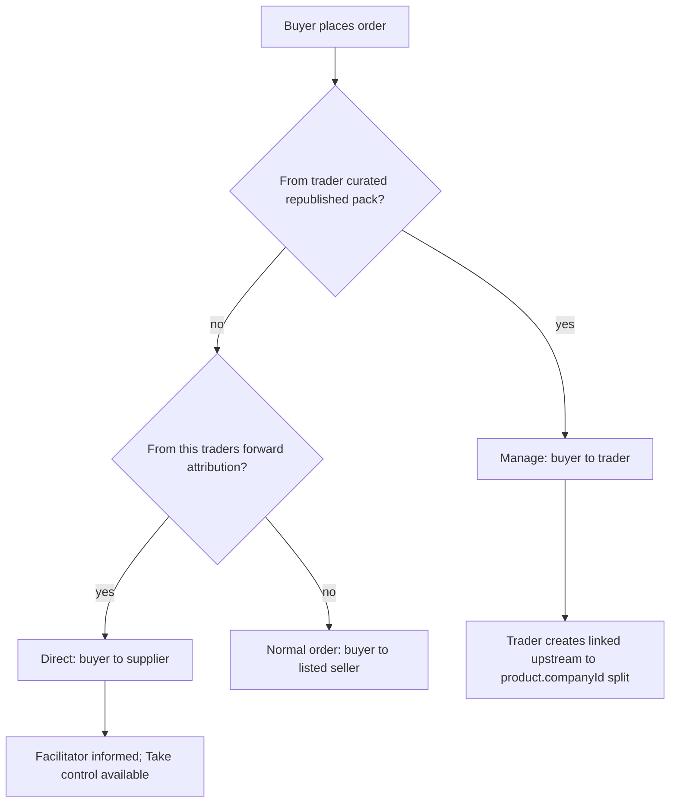

# Trader dual trade Slice B — design

**Date:** 2026-08-20  
**Status:** Approved (design) — platform trade-presence gate in B; deeper settings later  
**Surface:** Order routing **Direct** vs **Manage**, back-to-back linking, soft middleman protection; **Trading** presence toggle  
**Anchors:** [00-concepts.md](../../features/00-concepts.md), [orders.md](../../features/orders.md), [saved.md](../../features/saved.md), [settings.md](../../features/settings.md), [2026-08-19-trader-curation-slice-a-design.md](./2026-08-19-trader-curation-slice-a-design.md), [mvp-garmenthub-gap-matrix.md](../reviews/mvp-garmenthub-gap-matrix.md), [feature-gap-matrix.md](../reviews/feature-gap-matrix.md)

## Problem

Slice A lets dual-network companies **curate and republish** upstream product references under their business name. Buyers can Order multi-supplier packs via `POST /orders/batch`, which already splits by `product.companyId`.

What is missing:

1. **Manage** trade — buyer deals with the trader; trader orders upstream; **buyer and supplier must not see each other** (cut-out / eliminate-middleman risk).
2. **Direct** trade with a facilitating trader — order goes to the supplier, but the trader who forwarded stays **informed** (journey + chat) and can **Take control** if needed.
3. Clear separation from **Curate** (editorial trust / reach), which is not the same as Manage.

GarmentHub-style DIRECT vs managed trade is inspiration only; Ekum stays WhatsApp-simple (defaults, few exceptions, no mode sprawl).

## Goals

- **Trading presence** toggle beside Buying / Selling (not an OTP “Trader role”): when off, hide trader surfaces; when on, show Curate + dual-trade behaviors.
- **Direct vs Manage** routing with hard-coded defaults (connection/collection settings later).
- **Back-to-back linking:** Manage downstream (buyer↔trader) linked to upstream (trader↔supplier(s)), reuse batch split by `product.companyId`.
- **Soft hide** on Manage: UI and threads never expose the other end; no hard Connection blocks (Slice D).
- **Curated Explore visibility:** source supplier companies are **auto-excluded** from seeing a curated republish (Connections audience must not leak redistribution to upstream).
- **Take control** escape hatch on Direct when the facilitator needs Manage semantics.
- Opaque businesses; no trader badges; plain language in product (avoid “Direct/Manage” jargon in UI where possible).
- Document a **future settings ladder** (platform → connection → collection); only the platform **Trading** toggle ships in B.

## Non-goals (this slice)

| Out | Where |
|-----|--------|
| OTP / signup **Trader role** enum | Rejected — presence flag only |
| Full Connection / Collection **settings UI** | Later settings plan |
| **Managed buyers** list UI | Later settings; Take control covers exceptions until then |
| Hard anonymity (block Connection / direct thread between ends) | Slice D |
| Multi-hop chain UX beyond one Manage hop | Slice D |
| On-behalf / staff acting for another company | Later |
| Facilitator override “curated pack but Direct” as a first-class control | Later settings |
| Supplier notify / “who curated me” insights | Later / opt-in |
| Changing batch split itself | Already shipped |

## Trading presence (platform setting)

Same mental model as buy/sell — **You → Profile → Trade on Ekum**:

| Toggle | Flag in `tradeDefaults` | Product default | Meaning |
|--------|-------------------------|-----------------|--------|
| I buy on Ekum | `buyingEnabled` | on | Buying surfaces |
| I sell on Ekum | `sellingEnabled` | on | Selling / catalog surfaces |
| I trade on Ekum | `tradingEnabled` | **off** | Curate + dual-trade (Manage / Direct facilitator / Take control) |

**Not a role:** still one company account; no badge; capability is presence only (parallel to buy/sell).

**When `trading` is off (UI + API):**
- Hide **＋ → Curate pack** (and equivalent Catalog entry points).
- Do not offer Manage `from-pack` / Take control / facilitator chrome.
- API rejects `createFromPack`, Take control, and setting `facilitatorCompanyId` if the acting trader company has trading off (`TRADING_REQUIRED` plain copy).
- **Saved**, normal buy/sell Orders, own collections, Forward (when allowed) stay available.

**When `trading` is on:** Slice B + Curate surfaces show; routing defaults apply.

**QA / Slice B build:** product default remains **off**, but **keep Trading on for test** — seed/demo companies set `tradingEnabled: true`, and until B is verified on `main`, `resolveTradePresence` may treat **unset as on** so local/WIP testing does not require hunting Profile. Before calling B “done,” flip resolve so **unset = off** and leave seeds explicitly `true`.

## Vocabulary (locked)

| Term | Meaning |
|------|---------|
| **Curate / republish** | Editorial + reach — pack under **trader’s** name; trustworthy filter, not dump-all; not “fake stock” |
| **Manage** | Middleman **protection** — trader is counterparty; ends soft-hidden; upstream linked |
| **Direct** | Buyer↔**supplier** order; facilitating trader informed; can Take control |
| **Forward** | Share card/pack as-is (respect `allowForward`) |
| **Reference** | Unchanged from Slice A — order upstream uses real `product.companyId` |

Curate and Manage are **orthogonal**: curate answers *what* buyers see; Manage answers *who sees whom* on the Order.

## Routing (defaults)

| Situation | Mode | Seller on buyer-facing order |
|-----------|------|------------------------------|
| Order from **your curated / republished pack** | **Manage** | You (trader) |
| Order from **your forward** (attributed) | **Direct** | Supplier (`product.companyId`) |
| Order from supplier shop / Explore with no your share | Normal | Supplier |
| Own (non-curated) catalog | Normal | You |

**Managed buyers** (forwards → Manage for a few companies) and per-pack / platform overrides land in the **later settings** plan; until then defaults above + **Take control**.

## Manage — behavior

1. Buyer places one logical ask from the curated pack (multi-supplier lines OK).
2. System creates **downstream** order: `buyerCompanyId` = buyer, `sellerCompanyId` = pack owner (trader). Line snapshots may still reference foreign `productId`s (relax today’s “item company must equal seller” for Manage, or snapshot without that equality check when mode is Manage).
3. Trader creates **upstream** order(s) to each `product.companyId` (reuse batch grouping), **linked** to the downstream order (parent/source link — exact field names in implementation plan; pattern akin to return `escalatedFromReturnId` / `upstreamOrderId`).
4. **Soft hide:** buyer UI never shows supplier business names; supplier UI never shows buyer; no buyer↔supplier trade thread from this flow. Trader sees both sides and related-order lineage.
5. Lifecycles stay bilateral per order (quote/confirm/dispatch/deliver as today). Syncing status across the link (e.g. upstream dispatch → downstream cue) is in-scope as **light** trader-facing linkage, not full automatic mirror of every field (plan picks minimal sync).

## Direct — behavior

1. Existing buyer↔supplier order (batch split unchanged).
2. If the place path is attributed to a **facilitator** (forward), that company is recorded on the order (or link row) as facilitator.
3. Facilitator is **informed**: can open the order journey; participates in the trade chat with read (and presence) appropriate to “in the loop” — exact ACL in plan; must not grant supplier/buyer accidental identity leak beyond what Direct already implies (they already know each other).
4. **Take control:** facilitator becomes the managing party — downstream reframes to Manage semantics where feasible (trader as seller toward buyer; upstream to supplier; soft hide thereafter). Prefer explicit action over silent hijack. Details (amend existing order vs spawn linked pair) locked in implementation plan; product intent is “I take this trade.”

## Curated republish visibility (sources)

- **Default:** companies that own products **in** a curated pack **cannot** see that pack on Explore/shop/audience feeds — even if audience is Connections / Everyone and they are connected.
- Own-product-only collections: unchanged.
- No supplier notify on republish.
- Optional “visible to sources” → later settings.

Explore republish for **reach** remains encouraged when `allowForward` + ceiling allow; this rule only stops **upstream sources** from seeing the redistribution surface.

## Settings ladder

| Level | In Slice B | Later |
|-------|------------|--------|
| **Platform** (You → Trade on Ekum) | **Trading** toggle (`tradingEnabled`) | Curated Orders → Manage vs Direct; forwards → informed; sources see curated packs |
| **Connection** | — | Managed buyer; rare source-visible override |
| **Collection** | — | Rare Order-mode / show-to-sources override |
| **Order** | Take control (when trading on) | — |

Resolve later: most specific wins. Day-to-day path asks **zero** extra questions once defaults are set.

## Data / API (sketch for plan)

| Change | Intent |
|--------|--------|
| `tradeDefaults.tradingEnabled` + `TradePresence.trading` | Platform gate |
| Profile Trade toggle + gate Curate / dual-trade UI | Show only when on |
| Order link fields + `tradeMode` / facilitator / downstream link | Linking + Direct watch |
| Manage create path allows foreign `productId` on trader-as-seller order | Buyer orders curated pack from trader |
| Attribution on place from forward / curated pack | Route Direct vs Manage |
| Audience/discover filter excludes source `companyId`s for curated collections | Middleman pack privacy |
| Facilitator order ACL + Take control (requires trading on) | Informed + escape hatch |
| Trader order detail: related orders | Dual-trade clarity |

Prefer minimal schema; mirror return-escalate linking style where possible. No new Trade entity.

## Success criteria

- Profile shows **I trade on Ekum** beside buy/sell; product default off; seeds/QA can keep it on for testing.
- With trading **off**: Curate / Manage / Take control / facilitator UI hidden; APIs reject trader dual-trade actions.
- With trading **on**: Buyer Orders a multi-supplier **curated** pack → Manage downstream + linked upstreams; soft-hide holds.
- Buyer Orders via **forward** → Direct + facilitator informed; Take control works while trading on.
- Curated pack with Connections audience: source supplier company **does not** see the pack.
- Existing non-curated / non-facilitated orders unchanged when trading off.
- Batch split by `product.companyId` still used for upstream (and plain multi-supplier Direct).

## Open (plan detail, not product forks)

- Exact Prisma fields for link + facilitator + mode.
- Minimal cross-link status sync rules.
- Take control: mutate vs create-linked-pair.
- Forward attribution persistence (share/chat card metadata).
- Facilitator chat ACL granularity (read-only vs can message).

## Decision log

| Decision | Choice |
|----------|--------|
| Curate vs Manage | Orthogonal; curate = editorial/reach; Manage = hide ends |
| Default curated Order | Manage |
| Default forward Order | Direct + informed |
| Anonymity | Soft in B; hard in D |
| Trader “role” | Presence toggle `tradingEnabled` only — not OTP role |
| Trading default | **Off**; QA/seeds on while testing B; then unset=off |
| Deeper settings UI | Deferred; dual-trade mode defaults hard-coded |
| Sources see curated republish | No (auto-exclude); toggle later |
| Supplier notify on republish | No |
| Managed buyers UI | Later settings |
| Approach | Verb + defaults (+ Take control); not per-order mode picker |

## Next

Implementation plan via writing-plans after spec review sign-off. Update gap matrix when B ships.
