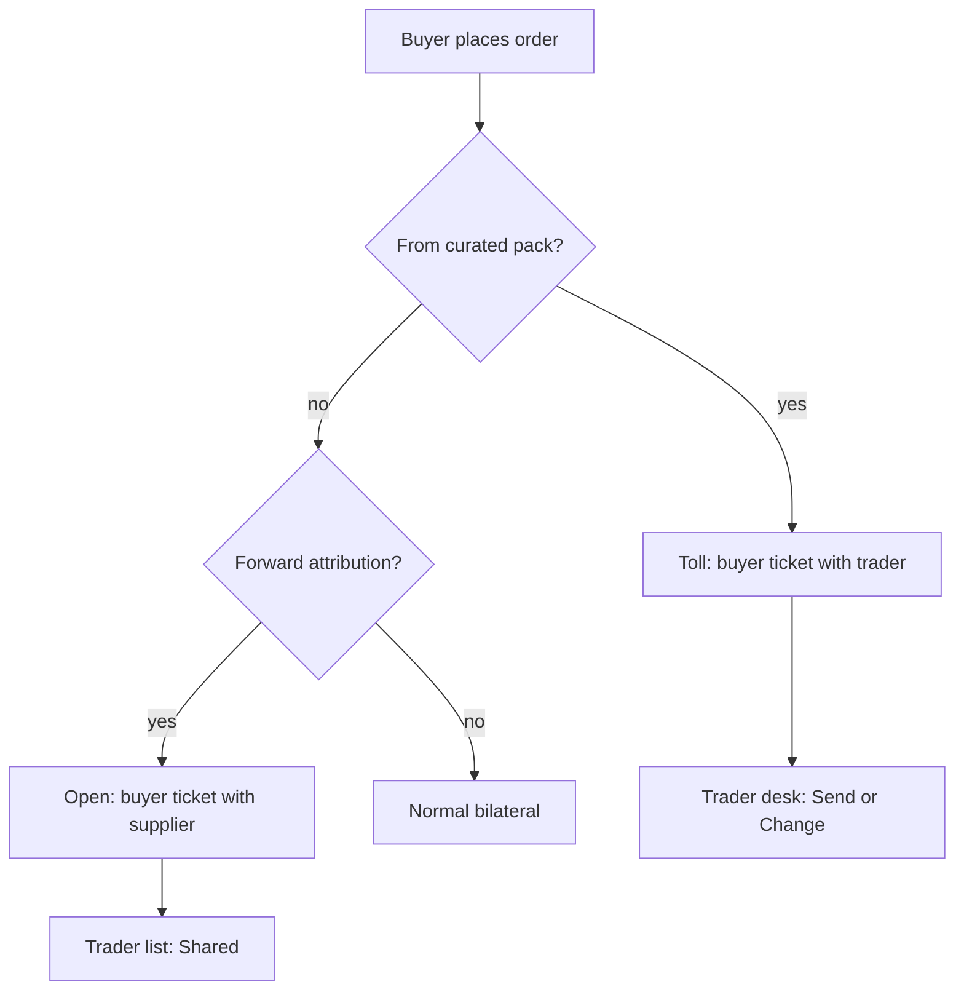

# Open path vs toll path — simplicity design

**Date:** 2026-08-21  
**Status:** Superseded  
**Superseded by:** [2026-08-21-direct-vs-handle-settings-design.md](./2026-08-21-direct-vs-handle-settings-design.md)

Kept for history. Product direction is now: **Profile default Direct / I handle**, override at share/publish/curate; curation ≠ handle; no auto curated→toll routing.

## Problem

Slice B named **Direct** / **Manage**. Users do not need those words. The real difference is:

1. Who Meena’s ticket is with  
2. Whether Kavita sees the ask before Ravi looks  
3. Whether Ravi must re-type everything twice (he must not)

We agreed: simplest UI, fewer taps, **one extra tap OK if it kills confusion**.

## Product bar

- Short words only: **Send**, **Change**, **Waiting**, **Shared**  
- Company names for parties — never mode names in UI  
- Common path = pass-through (**Send** as-is)  
- **Change** only when Ravi edits rate/qty  
- One trade desk for Ravi; Meena and Kavita each see **one** counterparty  
- Nobody should feel they are running two systems  

## Two paths (internal names; hide from UI)

| Path | Who buyer deals with | Trader job | Ends meet? |
|------|----------------------|------------|------------|
| **Open** | Supplier | Sees order (**Shared**); no gate | Yes |
| **Toll** | Trader | **Send** / **Change** gate each hop | No |

Internal API may still use `tradeMode: direct | manage`. Product copy must not.

## Entry routing (fix curated vs forward)

**Yes — keep and enforce these defaults.** No per-order mode picker.

| Buyer started from | Path | Seller on buyer order |
|--------------------|------|------------------------|
| **Trader’s curated / republished pack** | **Toll** | Trader |
| **Chat forward** of someone else’s album/design (`?facilitator=` / sticky) | **Open** | Catalog owner (supplier) |
| **Explore / shop** with no forward stamp | **Normal** | Listed seller (no trader) |
| Trader’s **own** (non-curated) catalog | **Normal** | Trader as seller |

Notes:

- **Curate ≠ toll.** Curate is what buyers see under the trader’s name. Toll is how the order runs when they order that pack.  
- **Explore forward:** if the buyer opened a design/album via a shared/forwarded card (facilitator sticky), that is **open**, same as chat forward — not toll. Cold Explore (no share context) stays normal.  
- Later settings may force toll for some buyers; out of scope here. Escape: open → trader **Handle** (today’s Take control) → toll.

## Open path — behaviour

1. One order: buyer ↔ supplier.  
2. Forwarder stamped; list/detail for them: **Shared** (not “You sell”).  
3. Counterpart for forwarder = supplier.  
4. Chat: **Forwarded by {name}** when sharer ≠ owner; **From {owner}** / order goes to owner (keep Option A clarity, shortest wording).  
5. Optional later: **Handle** moves the trade onto toll.

No approve gate. Supplier sees the ask when the buyer sends it.

## Toll path — behaviour (gate, not double typing)

Same three companies; trader is a **desk**, not a second typist.

1. Meena’s ask lands with **Ravi** first.  
2. **Kavita does not see it** until Ravi taps **Send** (or **Change** then Send).  
3. Default **Send** copies lines forward unchanged.  
4. **Change** = edit rates/qty, then Send.  
5. Kavita replies → back to Ravi’s desk → **Send** / **Change** to Meena.  
6. Each hop: same pattern. Status word when idle: **Waiting**.  
7. Meena always sees Ravi; Kavita always sees Ravi; Ravi sees both names on one desk.

Implementation shape (plan detail): linked downstream + upstream is fine **if** upstream stays held/invisible to supplier until Send, and copy-forward is the default. Light auto-mirror of every field is **not** required; pass-through Send is.

## Copy locked (UI)

| Situation | Copy |
|-----------|------|
| Trader primary action (pass-through) | **Send** |
| Trader edits then forwards | **Change** (then Send) |
| Waiting on other side | **Waiting** |
| Open-path list for forwarder | **Shared** |
| Chat forward label | **Forwarded by {name}** / **You forwarded** |
| Catalog owner on card | Owner company name (short) |
| Forbidden in UI | Direct, Manage, facilitator, toll, in the loop, take control (until **Handle** if needed) |

## Non-goals

- Per-order open/toll picker  
- Teaching users internal mode names  
- Forcing Ravi to re-enter lines on both sides  
- Hard Connection blocks (still Slice D)  
- Changing curated pack editorial rules  

## Gap vs shipped Slice B / forward

| Area | Today | This design |
|------|--------|-------------|
| Routing curated → manage / forward → direct | Largely in place | Keep; name as open/toll in docs only |
| Soft-hide + related orders | In place | Keep |
| Forward attribution + Shared clarity | Partially (Option A) | Finish short copy (**Shared**, etc.) |
| Toll **hold until Send** | Weak / early upstream create | **Fix** — supplier must not see until Send |
| Copy-forward Send / Change desk | Missing as product verbs | **Add** |
| Take control label | “Take control” | Prefer **Handle** when we touch that UI |

## Success

- Curated pack order → toll; Kavita blind until Ravi **Send**.  
- Chat / attributed Explore forward → open; Ravi **Shared**; Meena↔Kavita.  
- Cold Explore → normal.  
- Ravi’s happy path is one tap **Send**; **Change** only when editing.  
- No Direct/Manage words in the product.

## Decision log

| Decision | Choice |
|----------|--------|
| Curated pack | Toll |
| Chat / Explore forward with stamp | Open |
| Cold Explore | Normal |
| Trader effort | Gate + copy-forward, not double entry |
| Extra tap | Allowed if it reduces confusion |
| UI vocabulary | Send / Change / Waiting / Shared |
| Mode names in UI | Never |
